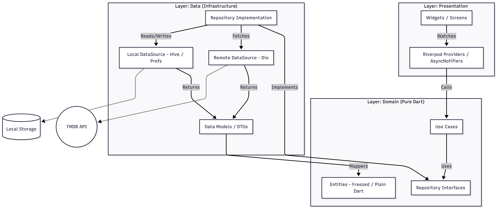
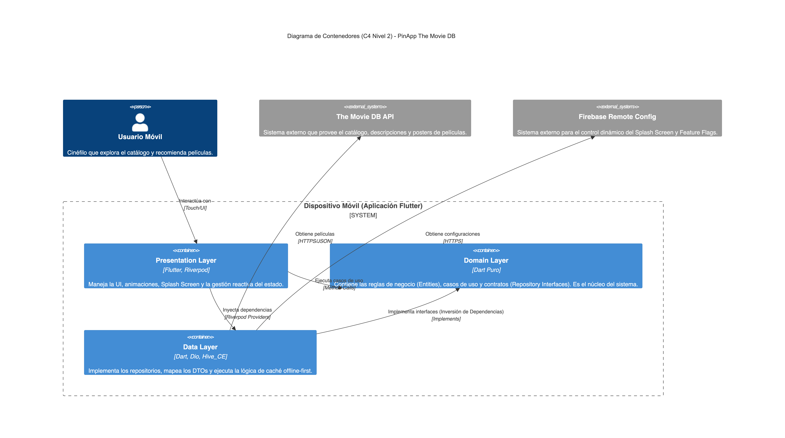
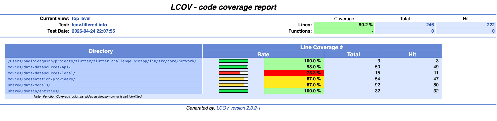

# 🎬 PinApp The Movie DB

Aplicación Flutter que consume la API de **TMDB** y muestra películas populares, mejor puntuadas y próximas a estrenarse. Implementada con **Clean Architecture(Feature First)**, **Riverpod** y estrategia **Offline-First** con Hive.

---

## 🎥 Demo


---

## 🚀 Quick Start

```bash
# 1. Instalar dependencias
flutter pub get

# 2. Configurar API Key de TMDB
cp .env.example .env
# Editar .env y pegar tu token de https://www.themoviedb.org/settings/api

# 3. Generar código (Riverpod / Freezed / Hive)
dart run build_runner build --delete-conflicting-outputs

# 4. Ejecutar
flutter run
```

---

## 🧱 Tech Stack

| Capa | Tecnología |
|------|------------|
| State Management | Riverpod (`@riverpod` generator) |
| Networking | Dio + Interceptors |
| Persistencia | Hive + SharedPreferences |
| Remote Config | Firebase Remote Config |
| Modelos | Freezed + json_serializable |

---

## 📂 Estructura del Proyecto

Organización de carpetas siguiendo Clean Architecture en tres capas (`domain`, `data`, `presentation`) más un módulo `core` transversal. Cada capa solo depende de la inmediatamente inferior, garantizando bajo acoplamiento y alta cohesión.



### Tabla de capas(Feature First)

| Capa | Responsabilidad | Depende de |
|------|-----------------|-----------|
| **Presentation** | UI, Widgets, Riverpod Notifiers | Domain |
| **Domain** | Entidades, UseCases, Interfaces (Dart puro) | — |
| **Data** | DTOs, DataSources (Dio/Hive), Repo Impl | Domain |
| **Core** | Red, errores, config global | — |

---

## 🗺️ Diagrama C4 — Nivel 2 (Contenedores)

Vista de contenedores que muestra cómo se comunican la app Flutter, la API de TMDB, Firebase Remote Config y el almacenamiento local Hive. Permite identificar de un vistazo las fronteras del sistema y los protocolos de integración entre cada bloque.


---

## 🚩 Firebase Remote Config — Feature Flags

Flags gestionados en Firebase Remote Config y servidos por `RemoteConfigService`. Los valores por defecto garantizan que la app funcione sin red desde el primer arranque.

| Flag | Tipo | Default | Efecto |
|------|------|---------|--------|
| `is_search_enabled` | `bool` | `true` | Muestra u oculta la pestaña de búsqueda en `HomeScreen` |
| `welcome_banner_text` | `String` | `"Discover your next favourite"` | Texto del banner en el app bar principal |
| `min_app_version` | `String` | `"1.0.0"` | Versión mínima requerida; se compara en runtime para bloquear versiones obsoletas |

---

## 📝 ADRs (Decisiones Arquitectónicas)

### ADR-001 · State Management: Riverpod Generator
- **Decisión:** Usar Riverpod con `@riverpod` en lugar de BLoC o GetX.
- **Por qué:** DI segura en compilación, `autoDispose` por defecto evita fugas de memoria y reduce boilerplate.
- **Trade-off:** Dependencia de `build_runner` para generar código.

| Criterio | BLoC | **Riverpod** ✅ | GetX |
|----------|------|----------------|------|
| **Predecibilidad** | Máxima — eventos e estados inmutables | Alta — proveedores reactivos y tipados | Baja — estado imperativo/global |
| **Explainability** | Excelente — trazas evento→estado claras | Buena — grafo de dependencias visible en `ProviderScope` | Pobre — difícil saber quién mutó qué |
| **Boilerplate** | Alto — eventos, estados, bloc por feature | Medio — una anotación `@riverpod` genera el provider | Muy bajo, pero a costa de opacidad |
| **Testing** | Nativo y robusto (`bloc_test`) | Excelente — `ProviderContainer` aísla providers sin mocks | Difícil por dependencias globales (`Get.find`) |
| **DI en compilación** | No — registro manual | Sí — `@riverpod` genera código verificado en build time | No — `Get.put` resuelve en runtime |

### ADR-002 · Offline-First con Hive
- **Decisión:** Repositorio que consulta red; si no hay conexión, lee de Hive.
- **Por qué:** La app debe funcionar sin internet mostrando la última data cargada.
- **Regla:** Las entidades de dominio **no** llevan anotaciones de Hive — solo los DTOs en `data/`.

### ADR-003 · Separación DTO ↔ Entity (Mappers)
- **Decisión:** `MovieModel` (data) con `fromJson/toJson` + `toEntity()` hacia `Movie` (domain).
- **Por qué:** Si TMDB renombra campos, solo cambia el DTO. UI y UseCases no se tocan (OCP).

---

## 🧩 Implementación por capas (resumen)

- **Domain** → `Movie` como entidad inmutable con Freezed; `MovieRepository` como contrato abstracto; UseCases simples (ej. `GetPopularMovies`).
- **Data** → `MovieModel extends Movie` con `fromJson`; `MovieRemoteDataSource` (Dio) y `MovieLocalDataSource` (Hive); `MovieRepositoryImpl` resuelve la estrategia **Offline-First** de ADR-002 y mapea `DioException` → `Failure`.
- **Presentation** → `MoviesAsyncNotifier` con `@riverpod` exponiendo `AsyncValue<List<Movie>>`; widgets consumen estados `loading / data / error`.
- **Core** → `DioClient` con interceptores (auth token, logging), `ConnectivityChecker` y clases `Failure` (Network, Cache, Server).

---

## 🏅 Criterios de Calidad (QA Attributes)

Atributos de calidad priorizados para este proyecto y las tácticas técnicas concretas que los satisfacen. Cada fila traza la decisión hasta su ubicación exacta en la arquitectura, facilitando auditorías y revisiones de código.

| Atributo | Táctica Técnica | Ubicación en la Arquitectura |
|----------|----------------|------------------------------|
| **Explainability** | Typed Metadata Mapping | `domain/entities` + `data/models`: mapeo estricto y tipado de errores y reglas de negocio; la UI muestra mensajes exactos sobre el estado de la data. |
| **Safety** | Data Sanitization Interceptor | `data/repositories` + `core/network`: interceptor que valida inputs antes de procesarlos, previniendo envíos nulos o malformados. |
| **Latency (percibida)** | Riverpod AsyncValue (Offline-First) | `presentation/providers`: los Notifiers emiten `AsyncLoading` inicial y transicionan a `AsyncData` con cache local mientras actualizan en background. |
| **Cost / Resource Efficiency** | Hive-First Policy (TTL Caching) | `data/datasources/local`: el repositorio consulta Hive antes de llamar a la red; si el TTL es válido, ahorra la petición y consumo de batería. |

---

## 🧪 Code Coverage Report

```bash
flutter test              # corre los unit tests
./tool/coverage.sh        # tests + reporte lcov + gate ≥ 80 %
```

Cobertura actual: **90 %** (entities, models, datasources, repository, notifiers).



---

## 🎯 Principios SOLID aplicados

- **S** — Repositorios separados por entidad.
- **D** — UseCases dependen de interfaces, no de implementaciones.
- **I** — DataSources independientes para remoto y local.


Autor @paolojoaquinp
